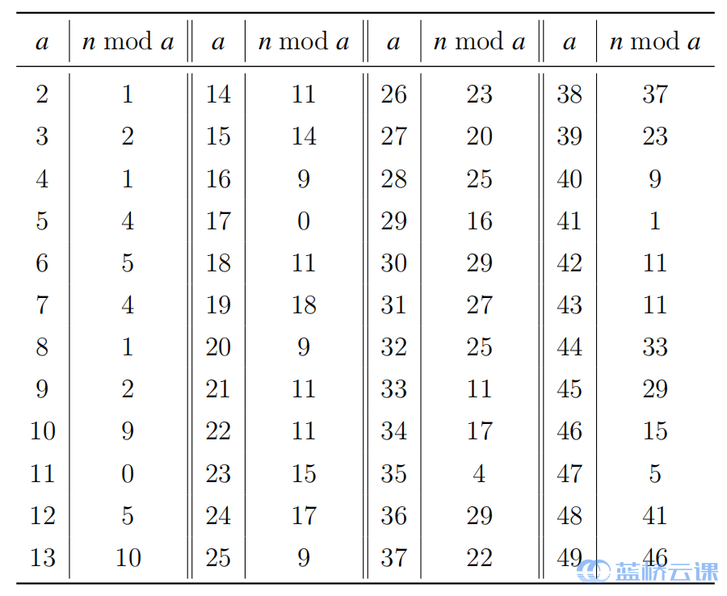

# 第13届Python A组
## 试题A：裁纸刀（5分）
**题目描述：**
> 本题为填空题，只需要算出结果后，在代码中使用输出语句将所填结果输出即可。\
小蓝有一个裁纸刀，每次可以将一张纸沿一条直线裁成两半。小蓝用一张纸打印出两行三列共 6 个二维码，至少使用九次裁出来。如果小蓝要用一张纸打印出 20 行 22 列共 440 个二维码，他至少需要裁多少次？

**代码示例：**
```py
# 观察到如果要让总裁剪次数最小，应当尽可能让裁剪的线条最长
# 由此，我们先沿与较长边平行的方向剪裁，然后沿列逐个剪下即可
# 总次数 = 4 + 19 + 20*21 = 443
ans = 4+19+21*20
print(ans)
```

## 试题B：寻找整数
**题目描述：**
> 有一个不超过 $10^{17}$ 的正整数 $n$，n，已知这个数除以 2 至 49 后的余数如下表所示，求这个正整数最小是多少。


**代码示例：**
```py
'''
# 首先注意到这个数是11和17的公倍数，由于11和17都是素数，所以这个数一定是11*17的倍数，搜索步长为187
# 但数据量过大，当前步长仍然过小，会造成超时，需要进一步找出更大的搜索步长
getM = [0,0,1,2,1,4,5,4,1,2,9,0,5,10,11,14,9,0,11,18,9,11,11,15,17,9,23,20,25,16,29,27,25,11,17,4,29,22,37,23,9,1,11,11,33,29,15,5,41,46]
# 先取最后几个较大的除数进行筛选，筛选出两个符合条件的数以后这两个数的差值就是更大的步长，只有满足这个步长的数才能满足后几个除数的条件
num = [] # 存储符合条件的数
LIMIT = 10**17
for i in range(187, LIMIT, 187):
    # check i 
    isvalid = True
    for j in range(44,50):
        if i%j != getM[j]:
            isvalid = False
            break
    if isvalid:
        num.append(i)
        if len(num) > 1:
            break
d = num[1] - num[0]
# use new step to search the result
for i in range(num[0],LIMIT,d):
    isValid = True
    for j in range(2,44):
        if i%j != getM[j]:
            isValid = False
            break
    if isValid:
        print(i)
        break
'''
print(2022040920220409) # 程序运算时间过长，直接在本地编译器上运行后打印结果
```

## 试题C：质因数的个数
**题目描述：**
> 给定正整数 n，请问有多少个质数是 n 的约数

**输入格式：**
> 输入一行，包含一个整数 n

**输出格式：**
> 输出一个整数，表示答案

**代码示例：**
```py
'''
# 可以直接从2开始逐个试除，但考虑到数据量很大，估计只能过60%
# 线性筛的模板题
# 先用线性筛打表，然后逐个试除
def sieve(n):
    is_prime = [True]*(n+1)
    prime = []
    for i in range(2,n+1):
        if is_prime[i]:
            prime.append(i)
        for j in prime:
            if i*j > n:
                break
            is_prime[i*j] = False
            if i%j == 0:
                break
    return prime

print(sieve(10**8))
'''
def sieve(n):
    prime = []
    is_prime = [True]*(n+1)
    for i in range(2, n+1):
        if is_prime[i]:
            prime.append(i)
            m = 2
            temp = m*i
            while temp <= n:
                is_prime[temp] = False
                temp += i 
    return prime

prime = sieve(100000000)
n = int(input())
ans = 0
for i in prime:
    if i > n:
        break
    isValid = False
    while n%i == 0:
        isValid = True
        n //= i
    if isValid:
        ans += 1
if n > 2:
    ans += 1
print(ans)
```
```py
# 只能过80%的测试样例
n = int(input())
ans=0
i=2
while i*i<=n:
    if n%i==0:
        ans+=1
        while n%i==0:
            n=n//i
    i+=1
if n>1:
    ans+=1
print(ans)
```

## 试题 D:矩形拼接
**题目描述：**
> 已知 3 个矩形的大小依次是 $a_1×b_1,a_2×b_2,a_3×b_3$ 。用这 3 个矩形能拼出的所有多边形中, 边数最少可以是多少?

**输入格式：**
> 输入包含多组数据。第一行包含一个整数 T, 代表数据组数。以下 T 行, 每行包含 6 个整数 $a_1,b_1,a_2,b_2,a_3,b_3$ 其中 $a_1,b_1$ 是第一个矩形的长和宽，$a_2,b_2$ 是第二个矩形的长和宽,$a_3,b_3$ 是第三个矩形的长和宽。

**输出格式：**
> 对于每组数据, 输出一个整数代表答案。

**代码示例：**
```py
# 经过分析，拼接后矩形一共有4，6，8三种边数，其中8条边的情况最多，所以使用排除法，判断是否是4条边或6条边
for i in range()
```